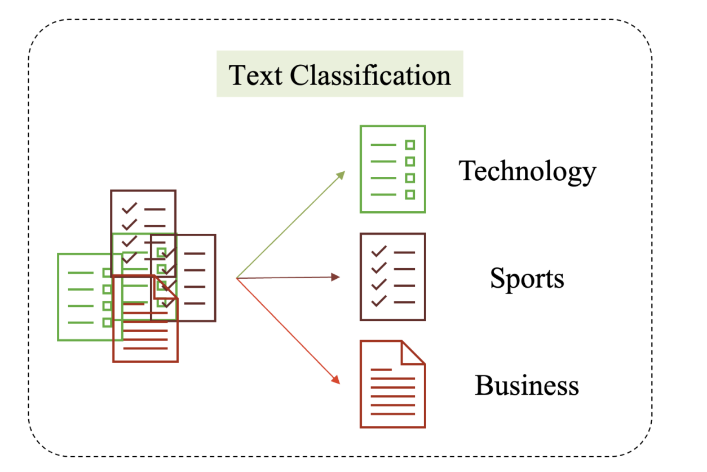

# Sentiment_Analysis

Chúng ta sẽ thực hành các nội dung về phân tích cảm xúc của khách hàng với các bình luận đánh giá phim dựa vào các phương pháp tiếp cận cho bài toán phân loại văn bản điển hình. Bài toán phân loại được lấy ví dụ như hình dưới. Với mỗi đơn vị văn bản sẽ được phân loại với một nhãn cụ thể thuộc tập hợp các nhãn cho trước.

Với mỗi đơn vị văn bản có thể thuộc vào tập các nhãn như: ‘Technology’, ‘Sports’, ‘Business’,...

Sentiment Analysis là nhóm các bài toán con thuộc vào phân loại văn bản. Với mục tiêu phân tích và đánh giá các bình luận của khách hàng cho các sản phẩm và tích cực, tiêu cực hay trung tính.  

Phần project này sẽ tập trung giải quyết cho bài phân tích cảm xúc trên bộ dữ liệu IMDB - Đánh giá phim.
